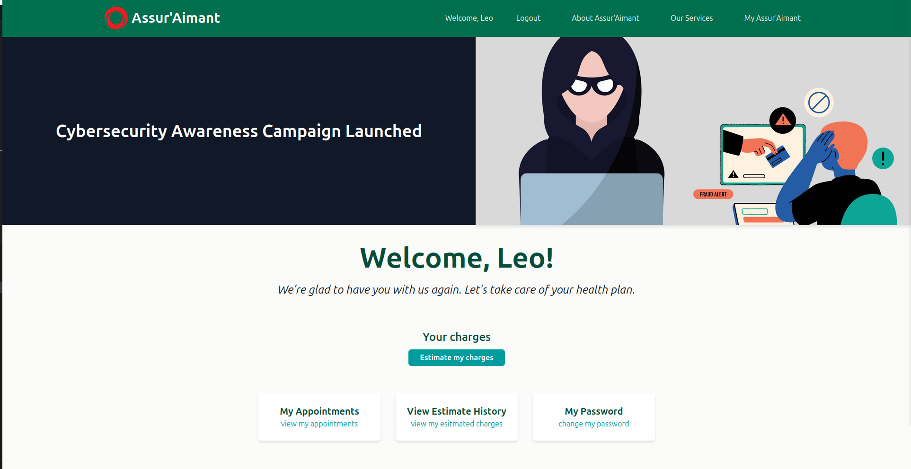

# Assur'Aimant: - Insurance Premium Prediction Web App

[](https://www.python.org/)
[](https://www.djangoproject.com/)
[](https://opensource.org/licenses/MIT)

A professional Django application for predicting insurance premiums using machine learning, featuring user authentication, profile management, and interactive prediction capabilities.

Here is a snip of the general home page:


Here is a snip of the client home page:




## Table of Contents
- [Features](#features)
- [Installation](#installation)
- [Directory Structure](#directory-structure)
- [Database Schema](#database-schema)
- [Configuration](#configuration)
- [Main Features](#main-features)
- [Contributing](#contributing)
- [License](#license)

## Features 🚀

**Core Functionality:**
- User authentication with secure password hashing
- Profile management system
- Insurance premium prediction using lasso regression
- Responsive UI with Tailwind CSS
- SQLite database integration
- Dynamic notifications and form validation

**Bonus Features:**
- Prediction history tracking
- Advisor appointment system
- Interactive prediction preview
- Mobile-responsive design

## Installation ⚙️

### Prerequisites
- Python 3.9+
- pip
- Node.js (for Tailwind CSS)

### Setup
```bash
# Clone repository
git clone https://github.com/MichAdebayo/brief_django_application.git
cd brief_django_application

# Create virtual environment
python -m venv venv
source venv/bin/activate  # Linux/MacOS
venv\Scripts\activate  # Windows

# Install dependencies
pip install -r requirements.txt

# Set up Tailwind CSS
npm install -D tailwindcss postcss autoprefixer
npx tailwindcss init -p

# Run migrations
python manage.py migrate

# Create admin user
python manage.py createsuperuser

# Run development server
python manage.py runserver

```
## Directory Structure 📂

```markdown
.
├── brief_app
│   ├── __init__.py
│   ├── asgi.py
│   ├── settings.py
│   ├── urls.py
│   └── wsgi.py
├── insurance_app
│   ├── model
│   │   ├── model.pkl
│   │   └── model_1.pickle
│   ├── static
│   │   ├── css
│   │   ├── flatpickr
│   │   ├── images
│   │   └── js
│   ├── templates
│   │   └── insurance_app
│   ├── templatetags
│   │   ├── __init__.py
│   │   └── custom_filters.py
│   ├── __init__.py
│   ├── admin.py
│   ├── apps.py
│   ├── forms.py
│   ├── models.py
│   ├── tests.py
│   ├── urls.py
│   └── views.py
├── node_modules
│   ├── @alloc
│   ├── @isaacs
│   ├── @jridgewell
│   ├── @nodelib
│   ├── @pkgjs
│   ├── @tailwindcss
│   ├── autoprefixer
│   │   ├── bin
│   │   └── lib
│   ├── caniuse-lite
│   │   └── dist
│   ├── nanoid
│   │   └── bin
│   ├── postcss
│   │   └── lib
│   ├── postcss-value-parser
│   │   └── lib
│   └── source-map-js
│       └── lib
├── resumes
│   └── test.pdf
├── templates
│   └── base.html
├── theme
│   ├── static_src
│   │   ├── src
│   │   ├── package-lock.json
│   │   ├── postcss.config.js
│   │   └── tailwind.config.js
│   ├── __init__.py
│   └── apps.py
├── manage.py
├── package-lock.json
├── package.json
├── requirements.txt
├── test.py
└── test_numpy.py
```

## Database Schema 🗄️


## Main Features 🔍

#### Prediction Flow

- User logs in

- Navigates to the prediction page

- Form pre-filled with profile data

- Interactive preview updates in real-time

- Submit to get final prediction

- Results saved to history (bonus), which can be viewed in the user's home page through the "view estimate history" link

#### Security Measures

- Password hashing with PBKDF2

- CSRF protection

- Input validation

- Session-based authentication


## Contributing 🤝

Create feature branch:


1. Copy

```bash
git checkout -b feature/your-feature
```


2. Commit changes

``` bash
git commit -m "Add your feature"
```

3. Push to branch:

``` bash
git push origin feature/your-feature
```

4. Open Pull Request (PR)

## License 📄

This project is licensed under the MIT License.

## Project Team:
[Michael Adebayo](https://github.com/MichAdebayo/) | [Eliandy Rymer](https://github.com/EliandyDumortier/) | [Dorothée Catry](https://github.com/DoroChan/)
